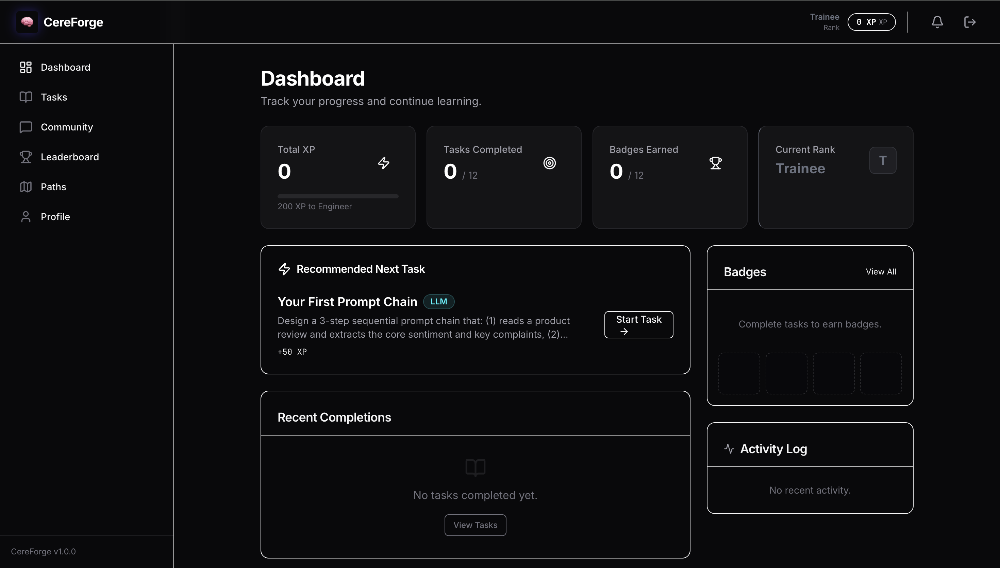
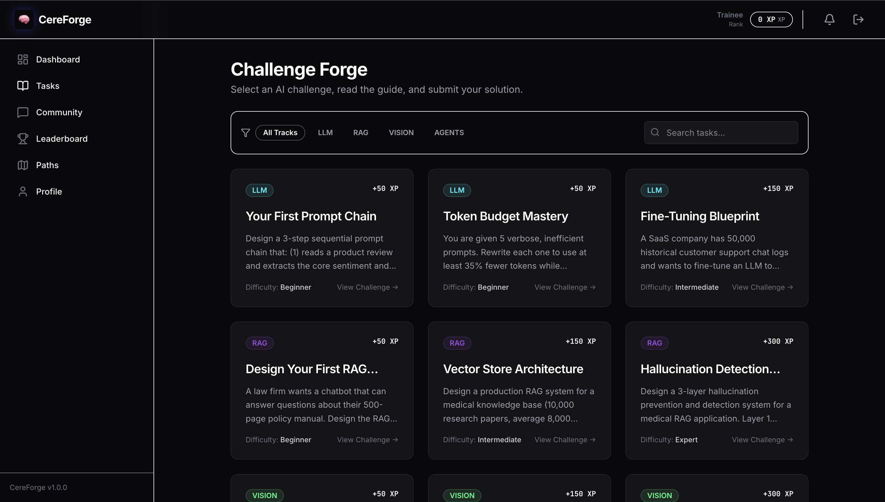
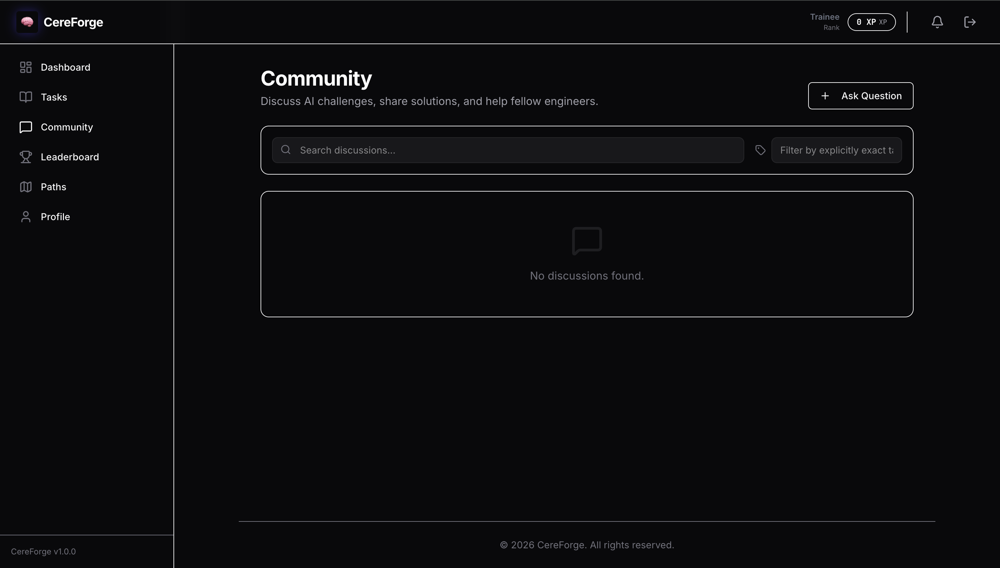
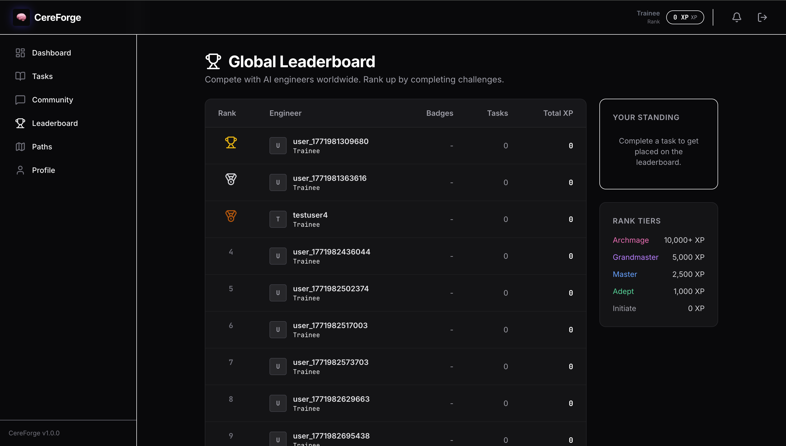

# CereForge

A learning platform I built for AI/ML engineering practice. The idea came from spending too much time on tutorials that explain concepts but never show you how to actually structure a real system — so the tasks here are more like mini design challenges than exercises.

Users complete tasks, earn XP, discuss in a community Q&A forum, and can follow structured learning paths. There's also an AI mentor built in that adjusts its hints depending on your stated skill level.

[](https://github.com/Siddharthpatni/Cereforge/actions)
[](https://opensource.org/licenses/MIT)

---

## Screenshots

<table>
  <tr>
    <td></td>
    <td></td>
  </tr>
  <tr>
    <td></td>
    <td></td>
  </tr>
</table>

---

## What it does

There are 24 tasks grouped across four tracks: LLM Engineering, RAG Pipelines, Computer Vision, and Autonomous Agents. Each task has a brief explanation, a progressive hint you can reveal if stuck, some resources, and a Colab notebook. Completing a task submits your solution to a Gemini-based evaluator that awards XP based on approach quality.

Outside the tasks, there's a community forum (Stack Overflow-style — votes, accepted answers, XP for good answers), a leaderboard, and a few learning paths that group tasks into structured progressions.

The admin portal lets admins view all users, edit XP, ban/unban accounts, and force-reset passwords.

---

## Stack

- **Backend**: FastAPI + SQLAlchemy 2 (async) + PostgreSQL + Redis
- **Frontend**: React 18 + Vite + Zustand
- **Auth**: JWT (access + refresh tokens) + bcrypt
- **AI**: Google Gemini (task evaluation + AI mentor + community thread summaries)
- **Infra**: Docker Compose + GitHub Actions

---

## Running it locally

The easiest way is the start script — it handles env vars, Docker, migrations and seeding:

```bash
git clone https://github.com/Siddharthpatni/Cereforge.git
cd Cereforge
./start_demo.sh
```

Then open:
- Frontend: `http://localhost:5173`
- API docs: `http://localhost:8000/docs`

Demo accounts (password for all: `password123`):
- `admin@cereforge.io` — admin access
- `beginner@gmail.com` — regular user

### Manual setup

```bash
# Backend
cd backend
python -m venv venv && source venv/bin/activate
pip install -r requirements.txt
cp .env.example .env   # fill in your values
alembic upgrade head
python -m app.seeds.run_all
uvicorn app.main:app --reload

# Frontend (separate terminal)
cd frontend
npm install
cp .env.example .env   # set VITE_API_BASE_URL
npm run dev
```

---

## Environment variables

Backend (`backend/.env`):

| Variable | Notes |
|---|---|
| `DATABASE_URL` | asyncpg format: `postgresql+asyncpg://...` |
| `JWT_SECRET_KEY` | generate with `python -c "import secrets; print(secrets.token_hex(64))"` |
| `APP_SECRET_KEY` | same as above |
| `GOOGLE_API_KEY` | for Gemini evaluation + AI mentor |
| `SMTP_HOST` | optional — needed for password reset emails |

Frontend (`frontend/.env`):

| Variable | Notes |
|---|---|
| `VITE_API_BASE_URL` | e.g. `http://localhost:8000/api/v1` |

---

## Project structure

```
Cereforge/
├── docker-compose.yml
├── start_demo.sh
├── frontend/
│   └── src/
│       ├── pages/        # one file per route
│       ├── components/
│       ├── stores/       # zustand stores
│       └── api/          # axios client + request helpers
└── backend/
    └── app/
        ├── main.py
        ├── api/routes/   # one file per feature area
        ├── models/       # SQLAlchemy models
        ├── schemas/      # Pydantic schemas
        ├── services/     # business logic (XP, badges, evaluation)
        └── seeds/        # seed scripts for demo data
```

---

## Tests

```bash
cd backend
pytest tests/ -v
```

43 tests, all passing. The CI runs ruff (lint + format) and pytest on every push.

---

## Deployment

I haven't deployed this publicly yet. The intended setup would be:
- Backend on Render or Railway
- Frontend on Vercel
- DB on Supabase (free tier works fine for this scale)

---

## License

MIT
