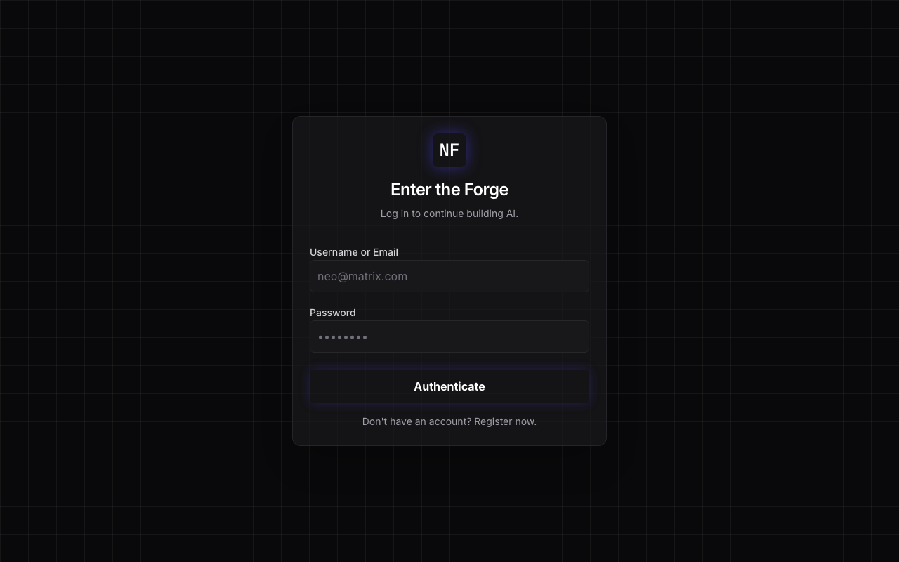
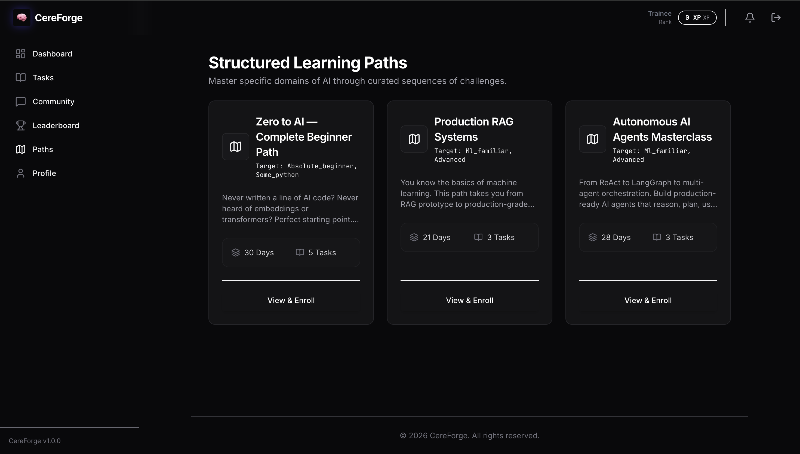

<div align="center">
  

  # 🧠 CereForge
  **Forge Your AI Mind.**
  
  <p>
    CereForge is the open-source competitive learning platform for AI &
    Autonomous Systems engineers. Complete real engineering challenges,
    earn XP and badges, and get help from a community that's been exactly
    where you are — whether you're a complete beginner or already shipping
    production AI systems.
  </p>

  [](https://github.com/Siddharthpatni/Cereforge/actions)
  [](https://opensource.org/licenses/MIT)
  [](https://www.python.org/downloads/)
  [](https://react.dev/)

</div>

---

## 📸 Screenshots

<table>
  <tr>
    <td align="center" width="50%">
      
      <br/><em>Dashboard — XP progress, badges, and your next challenge</em>
    </td>
    <td align="center" width="50%">
      
      <br/><em>Task Explorer — 12 AI engineering challenges across 4 tracks</em>
    </td>
  </tr>
  <tr>
    <td align="center" width="50%">
      
      <br/><em>Registration — Skill-level selector for personalized experience</em>
    </td>
    <td align="center" width="50%">
      
      <br/><em>Learning Paths — Curated challenge sequences to master specific domains</em>
    </td>
  </tr>
  <tr>
    <td align="center" width="50%">
      
      <br/><em>Community — Stack Overflow-style Q&A for AI engineers</em>
    </td>
    <td align="center" width="50%">
      
      <br/><em>Leaderboard — See where you rank against other engineers</em>
    </td>
  </tr>
</table>

---

## What is CereForge?

CereForge is built for the engineers who are tired of tutorials that stop
before production, AI courses that don't cover real engineering decisions,
and forums where nobody answers AI questions properly.

It covers the four tracks that matter in production AI:

| Track | What You Learn |
|-------|----------------|
| 🤖 **LLM Engineering** | Prompt chains, token optimization, fine-tuning strategy |
| 📚 **RAG Pipelines** | Vector stores, chunking, hallucination prevention |
| 👁️ **Computer Vision** | Object detection, multimodal systems, edge deployment |
| ⚡ **Autonomous Agents** | LangChain, LangGraph, multi-agent orchestration |

Every track has 3 challenges: Beginner (50 XP) → Intermediate (150 XP) → Expert (300 XP).

---

## Features

### 🎯 Task-Based Learning
12 hands-on challenges that simulate real engineering decisions. Not toy examples —
actual production design problems with real tradeoffs. Each task includes:
- Plain English beginner guide (no jargon assumed)
- A progressive hint you can reveal when stuck
- Curated resources to learn what you need
- A Google Colab notebook for practical implementation
- An AI Mentor that adapts its guidance to your skill level

### 🏆 Gamification That Means Something
- **XP System**: earn points for completing tasks, helping in community, getting answers accepted
- **5 Rank Tiers**: Trainee → Engineer → Architect → Autonomous → CereForge Elite
- **12 Badges**: each with a cinematic unlock animation that feels genuinely rewarding
- **Live Leaderboard**: real-time ranking against every other engineer on the platform

### 💬 Community Q&A
Stack Overflow-style forum where real AI engineers ask and answer questions:
- Vote up helpful answers, vote down unhelpful ones
- Post author can mark the best answer as accepted (awards bonus XP)
- Filter by track, tag, difficulty level, or "beginner-friendly" only
- AI-powered summary of any discussion thread

### 🗺️ Adaptive Learning Paths
Three structured paths for different starting points:
- **Zero to AI (30 days)** — for complete beginners, no experience assumed
- **Production RAG Systems (21 days)** — intermediate, build enterprise RAG
- **Autonomous AI Agents Masterclass (28 days)** — advanced, LangGraph + multi-agent

---

## Tech Stack

- **Backend**: Python 3.11, FastAPI, SQLAlchemy 2.0 (async), PostgreSQL, Redis, Celery, JWT
- **Frontend**: React 18, Vite, Tailwind CSS, Zustand, React Query, Framer Motion, TipTap
- **Infrastructure**: Docker, Docker Compose, GitHub Actions CI/CD
- **AI**: Anthropic Claude (AI Mentor feature)

---

## Quick Start (For Reviewers / Professors)

The easiest way to evaluate CereForge locally is using the one-click startup script. This script automatically generates secure environment variables, boots the Docker containers, runs database migrations, and seeds the initial AI tasks and learning paths.

```bash
git clone https://github.com/Siddharthpatni/Cereforge.git
cd Cereforge

# Run the 1-click setup script
./start_demo.sh
```

**What the script does automatically:**
1. Copies `.env.example` configurations and generates secure JWT tokens.
2. Builds and starts the `docker-compose` stack (PostgreSQL, Redis, FastAPI, React/Vite, Celery).
3. Waits for the database to become healthy.
4. Runs SQLAlchemy Alembic migrations to create tables.
5. Runs the seed scripts (`python -m app.seeds.run_all`) to populate tasks, users, and community data.

**Once finished, access the platform at:**
- Web Sandbox: `http://localhost:5173`
- Backend API Docs: `http://localhost:8000/docs`

**Pre-seeded Demo Accounts:**
- `admin@cereforge.io` (Admin)
- `newuser@example.com` (Beginner)
- `pro@example.com` (Expert)
*(Password for all demo accounts: `password123`)*

---

## Manual Setup

### Backend
```bash
cd backend
python -m venv venv && source venv/bin/activate
pip install -r requirements.txt
cp .env.example .env        # edit with your values
alembic upgrade head
python -m app.seeds.run_all
uvicorn app.main:app --reload --port 8000
```

### Frontend
```bash
cd frontend
npm install
cp .env.example .env        # set VITE_API_BASE_URL=http://localhost:8000/api/v1
npm run dev
```

---

## Environment Variables

### Backend (`backend/.env`)
| Variable | Required | Description |
|----------|----------|-------------|
| `DATABASE_URL` | ✅ | PostgreSQL connection string |
| `REDIS_URL` | ✅ | Redis connection string |
| `JWT_SECRET_KEY` | ✅ | 64-char random string for JWT signing |
| `APP_SECRET_KEY` | ✅ | 64-char random string for app secrets |
| `ANTHROPIC_API_KEY` | ✅ | Anthropic API key for AI Mentor |
| `APP_ENV` | ✅ | `development` or `production` |
| `SMTP_HOST` | ☐ | Email host (disables email verification if not set) |

Generate secure keys:
```bash
python -c "import secrets; print(secrets.token_hex(64))"
```

### Frontend (`frontend/.env`)
| Variable | Required | Description |
|----------|----------|-------------|
| `VITE_API_BASE_URL` | ✅ | Backend API URL (e.g. `http://localhost:8000/api/v1`) |

---

## API Reference

Full interactive docs at `http://localhost:8000/docs` when running locally.

| Method | Endpoint | Description |
|--------|----------|-------------|
| POST | `/api/v1/auth/register` | Create account with skill level |
| POST | `/api/v1/auth/login` | Login, receive JWT tokens |
| GET | `/api/v1/auth/me` | Get current user + rank + badges |
| GET | `/api/v1/tasks` | List tasks (filter by track/difficulty) |
| POST | `/api/v1/tasks/{slug}/submit` | Submit solution, earn XP + badges |
| GET | `/api/v1/posts` | Browse community Q&A |
| POST | `/api/v1/posts` | Ask a question |
| POST | `/api/v1/vote` | Vote on posts and answers |
| GET | `/api/v1/leaderboard` | View rankings |
| GET | `/api/v1/dashboard` | Personalized dashboard data |
| POST | `/api/v1/ai-mentor/guidance` | AI Mentor (streamed) |
| GET | `/api/v1/health` | Health check |

---

## Running Tests

```bash
# Backend — all tests with coverage
cd backend
pytest tests/ -v --cov=app --cov-report=term-missing

# Frontend — unit tests
cd frontend
npm run test -- --run
```
Target: backend coverage ≥ 75%, all tests pass.

---

## Project Structure

```
cereforge/
├── backend/
│   ├── app/
│   │   ├── api/routes/       ← Route handlers (auth, tasks, community...)
│   │   ├── core/             ← Config, database, Redis, security
│   │   ├── models/           ← SQLAlchemy ORM models
│   │   ├── schemas/          ← Pydantic request/response schemas
│   │   ├── services/         ← Business logic (badges, XP, notifications)
│   │   └── seeds/            ← Idempotent data seeders
│   ├── tests/                ← Pytest test suite
│   ├── alembic/              ← Database migrations
│   └── Dockerfile
├── frontend/
│   ├── src/
│   │   ├── components/       ← Reusable UI components
│   │   ├── pages/            ← Page-level components
│   │   ├── stores/           ← Zustand state stores
│   │   ├── hooks/            ← Custom React hooks
│   │   └── api/              ← Axios client and API functions
│   └── Dockerfile
├── docs/screenshots/         ← README screenshots
├── scripts/                  ← Utility scripts (take_screenshots.js)
├── docker-compose.yml
└── .github/workflows/ci.yml
```

---

## Deployment

**Backend → Render**
1. New Web Service → connect GitHub repo
2. Root directory: `backend`
3. Build: `pip install -r requirements.txt && alembic upgrade head && python -m app.seeds.run_all`
4. Start: `uvicorn app.main:app --host 0.0.0.0 --port $PORT`
5. Add all env vars from `backend/.env.example`

**Frontend → Vercel**
```bash
cd frontend && npx vercel --prod
# Set VITE_API_BASE_URL to your Render backend URL
```

**Database → Supabase (free tier)**
1. Create project at supabase.com
2. Copy the connection string (use the asyncpg format)
3. Set as `DATABASE_URL` in your backend env vars

---

## Contributing

The most valuable contribution is new task content.
If you've solved a real AI engineering problem and can turn it into a well-crafted challenge with a beginner guide, hint, and resources — open an issue and we'll help you add it.

For code contributions:
1. Open an issue to discuss before building anything large
2. Fork → branch → PR
3. All tests must pass, coverage must not drop
4. One PR per feature or fix

---

## License

MIT — see [LICENSE](LICENSE)

<div align="center">
  <strong>Built by engineers who got tired of half-finished AI tutorials.</strong>
  <br/><br/>
  <a href="https://github.com/Siddharthpatni/Cereforge/issues">Report Bug</a>
  ·
  <a href="https://github.com/Siddharthpatni/Cereforge/issues">Request Feature</a>
  ·
  <a href="https://github.com/Siddharthpatni/Cereforge/discussions">Join Discussion</a>
</div>
