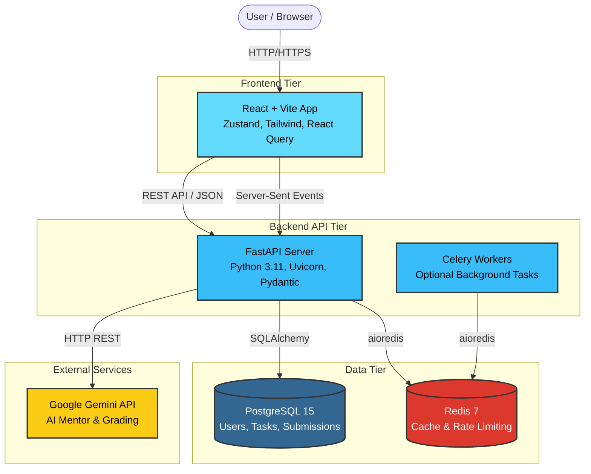
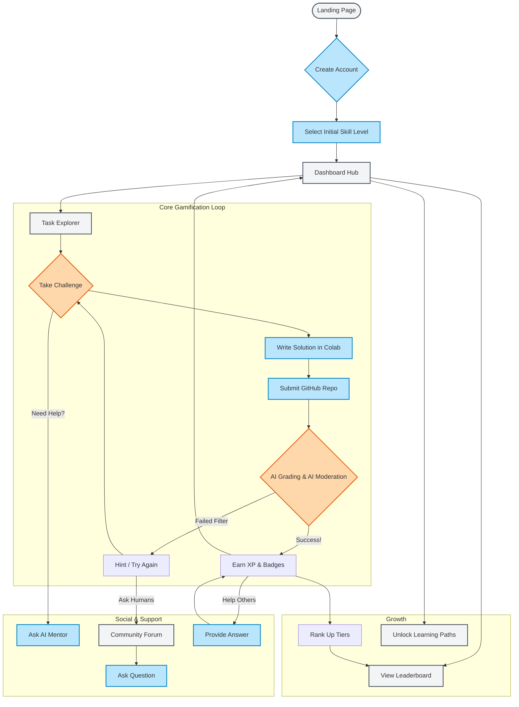
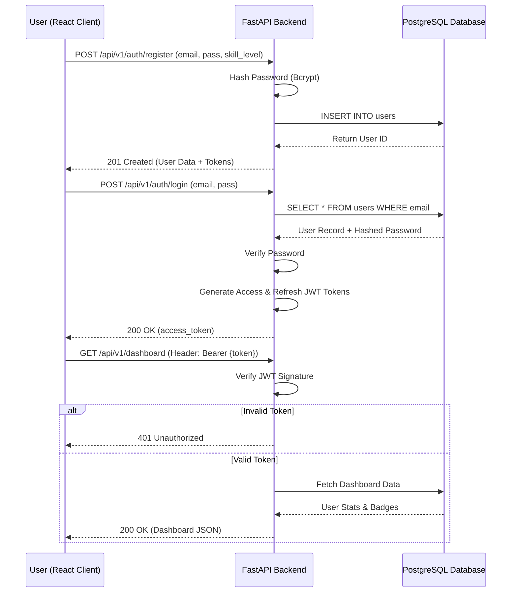
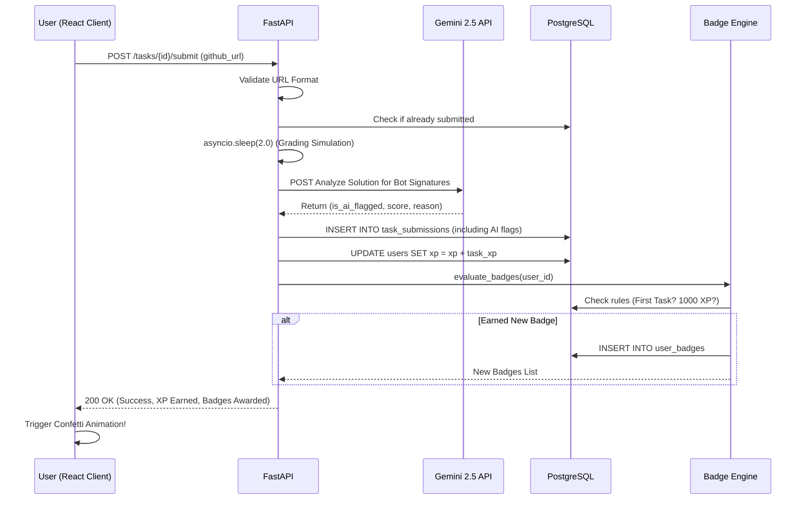
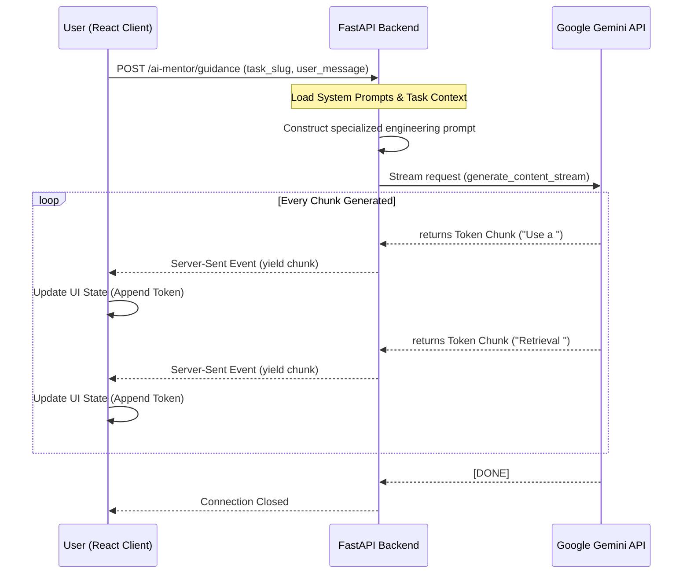
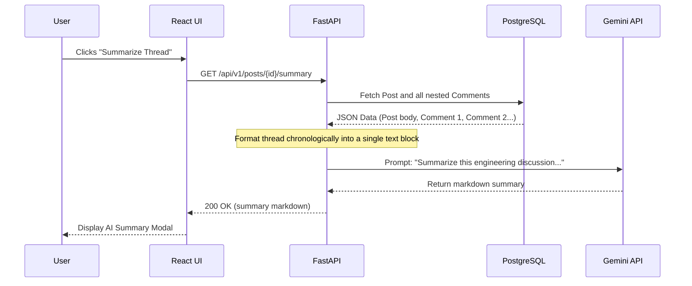

# CereForge System Architecture & Flows

This document outlines the core architecture and user flows of the CereForge application using standard Mermaid.js sequence and system diagrams. These can be rendered directly in GitHub or viewed in markdown presentation tools.

## 1. High-Level System Architecture

This diagram shows the container-level architecture of the CereForge platform.

---

## 2. Proper Graphical Flow Chart: User Journey

This flowchart illustrates the overarching graphical flow a user takes through the CereForge application from landing to elite mastery.

---

## 2. Authentication & JWT Flow

How a user registers, logs in, and secures subsequent API requests across the platform.

---

## 3. Challenge Task Submission & Grading Flow

The core gamification loop. Users write a solution in a notebook, submit the URL, and the system simulates grading, checks for AI moderation, and awards XP.

---

## 4. Real-time AI Mentor Streaming Flow

When a user gets stuck, they can ask the AI Mentor for guidance. The platform uses Server-Sent Events (SSE) to stream the LLM response back to the React UI in real-time.

---

## 5. Community Q&A & AI Summarization

The forum functionality where users can ask questions and request an AI to summarize a long thread.

